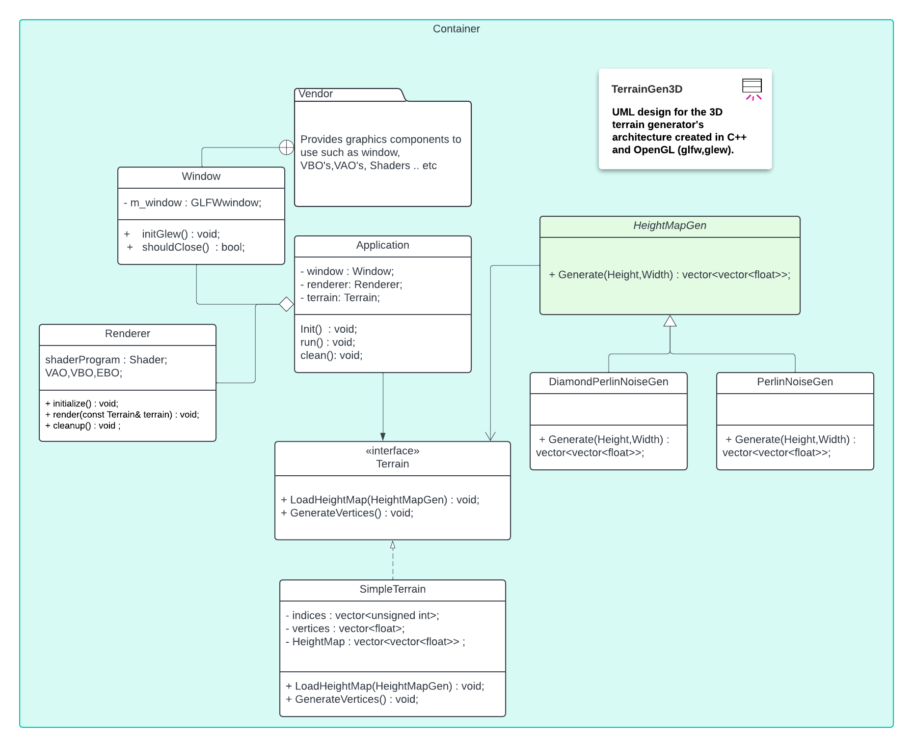
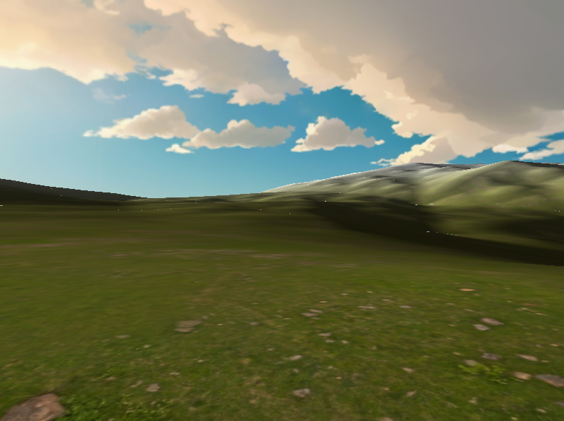
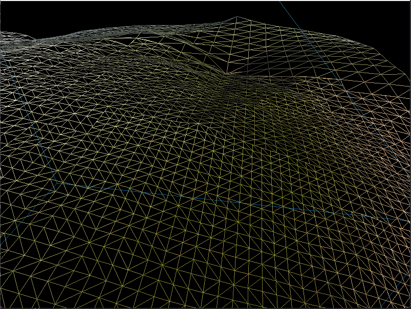

# Procedural Terrain Generation

[](https://choosealicense.com/licenses/mit/)


This project explores the beauty of procedural graphics by combining terrain generation with advanced rendering techniques. The engine is capable of creating vast, realistic landscapes using a mix of algorithms and modern GPU features, implementation adopted from the book 3D Terrain Programming.


## Key Features:

Procedural Terrain Generation:
Implemented with different algorithms (Fault Formation, Midpoint Displacement), each producing unique terrain styles that can be tuned.

Tessellation Shaders:
Real-time tessellation adapts terrain detail dynamically based on the camera’s distance, keeping performance high while ensuring close-up surfaces look detailed and sharp.

Skybox & Lighting System:
A dynamic skybox with realistic lighting and fog gives each generated terrain a natural feel.

## Acknowledgements

- 3D Terrain Rendering Book by Trent Polack
- Learnopengl.com


## Installation

```bash
  git clone https://github.com/Yousef-Albasel/GenTerrain3D
  cd GenTerrain3D
```
Make sure you’re using Visual Studio 2019/2022 with Desktop development with C++ workload installed.

In Visual Studio, set the solution platform to x86 (32-bit).

If the option doesn’t exist, add it via Configuration Manager.
## Screenshots





